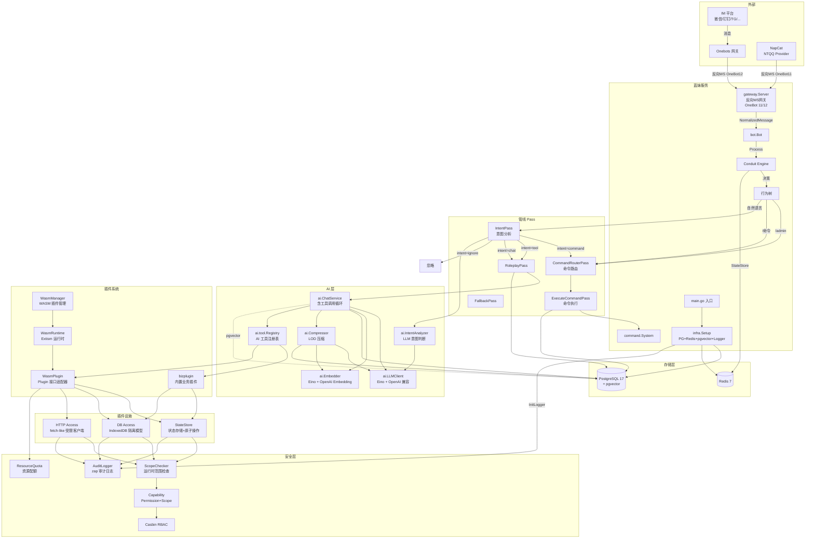
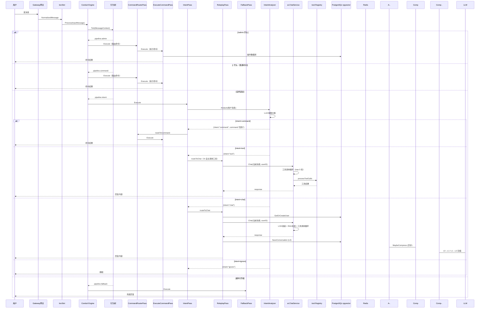
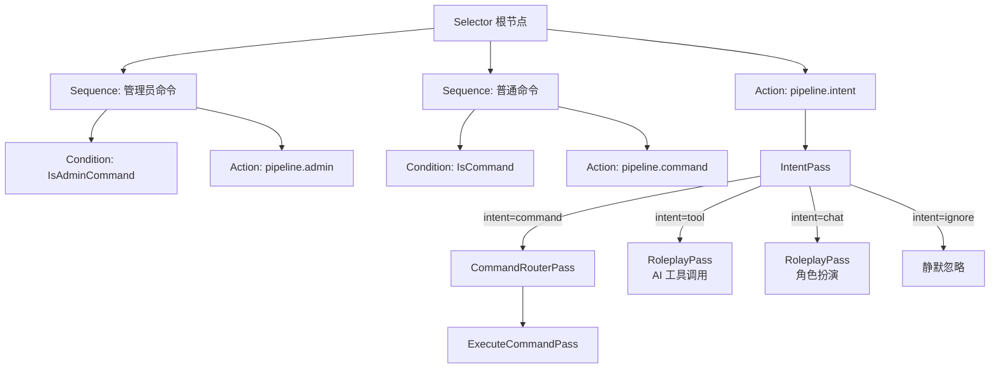
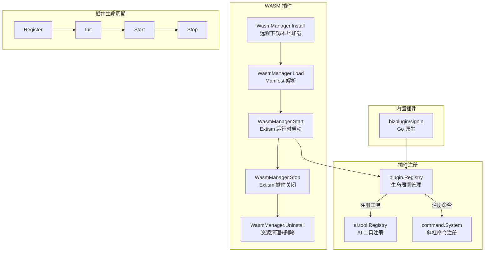
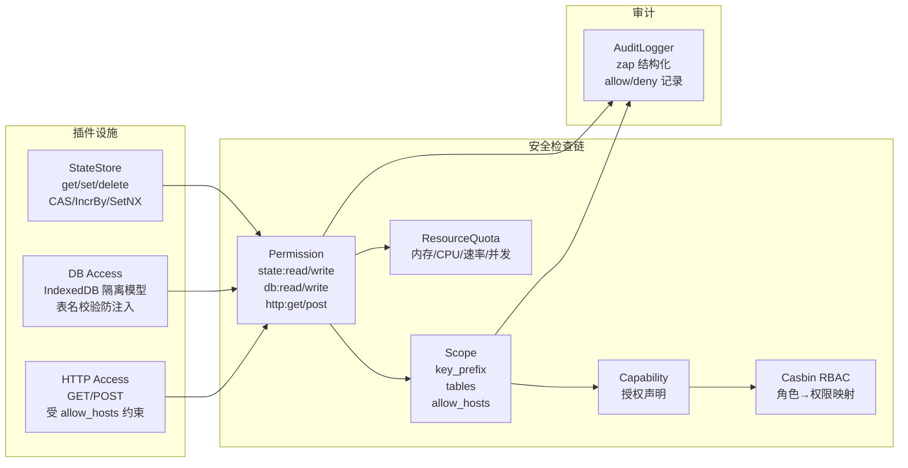
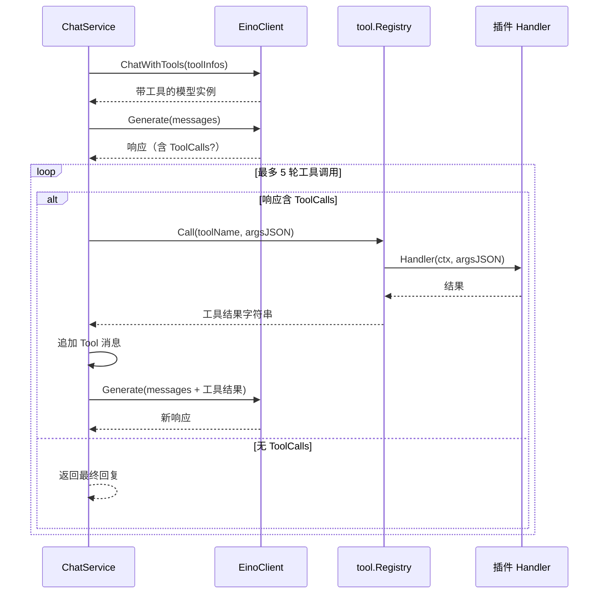
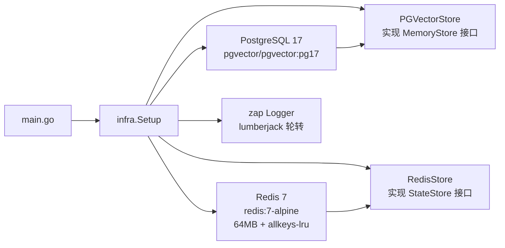

# 蓝妹架构图

## 系统总览

## 消息处理流程

## 行为树结构

优先级从上到下：管理员命令 > 普通命令 > 意图分析（自然语言路由）

## 插件系统架构

## 插件设施与安全模型

## AI 工具调用流程

## 基础设施层

## 存储层设计

## 已实现 / 规划中

- [x] LLMClient 实现（Eino 框架 + eino-ext OpenAI 兼容层，支持 ToolCalling）
- [x] Embedder 实现（Eino 框架 + eino-ext OpenAI Embedding）
- [x] Function Calling 自然语言命令路由（IntentPass，4 种意图：command/tool/chat/ignore）
- [x] AI 工具注册表（tool.Registry，基于 Eino schema.ToolInfo + ToolCallingChatModel）
- [x] 插件系统（内置 bizplugin + WASM Extism 运行时）
- [x] 插件设施（StateStore 原子操作、DB Access IndexedDB 隔离、HTTP Access 受限客户端）
- [x] 安全模型（Casbin RBAC + Permission + Scope + Capability + ResourceQuota）
- [x] 审计日志（zap 结构化 AuditLogger）
- [x] 统一日志（zap + lumberjack 轮转，替换 log.Printf/slog）
- [x] Command 管线优化（CommandRouterPass + ExecuteCommandPass 分离）
- [x] WIT 接口定义（schema/plugin/lanmei-plugin.wit，含 db/http Host Functions）
- [x] LOD 记忆压缩（L0 原文 → L1 摘要 → L2 主题）
- [x] 多路召回（向量 + 关键词 + 时间，memory.MultiRetriever 加权合并）
- [ ] 签到记录表
- [ ] 状态面板前端
