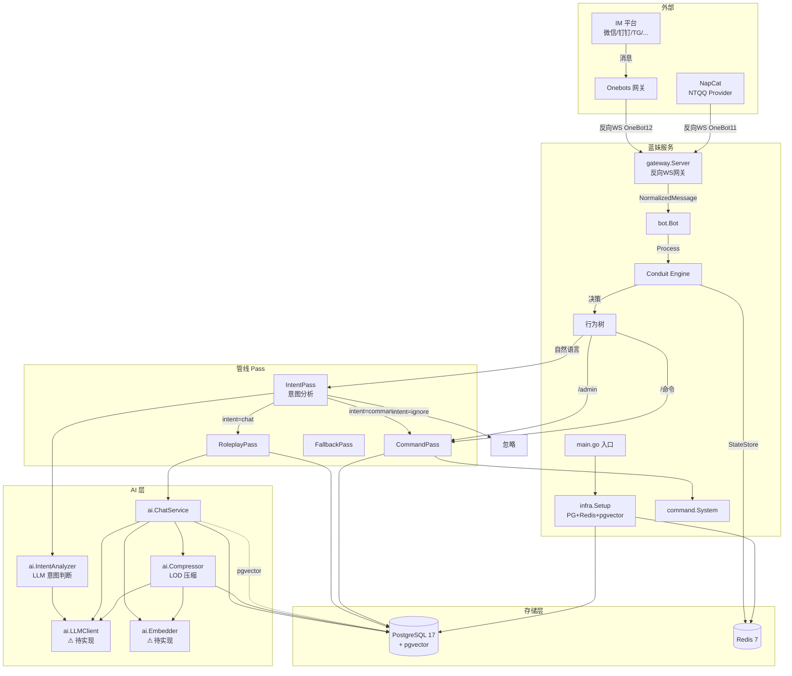
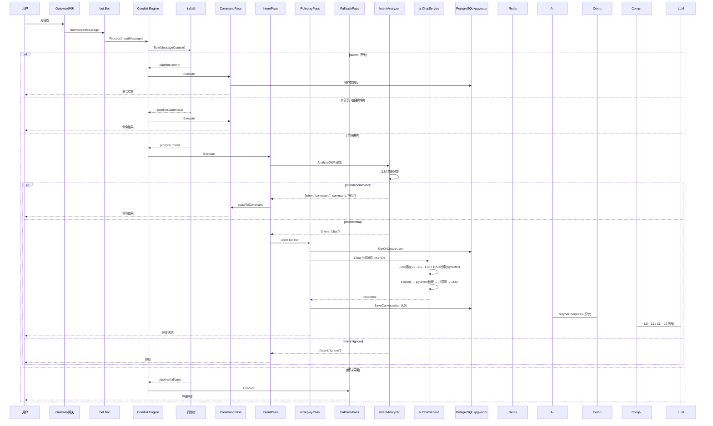
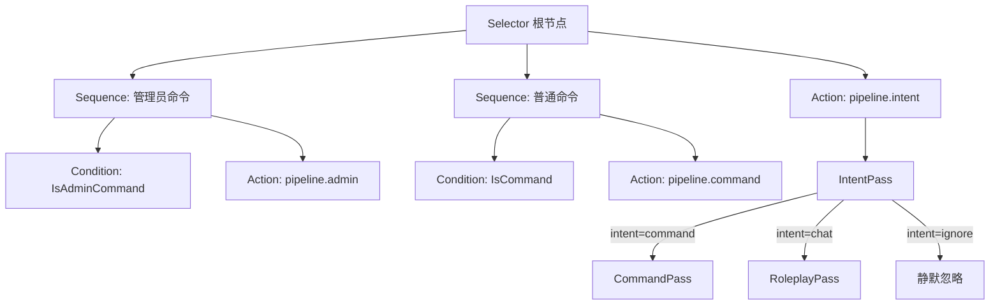
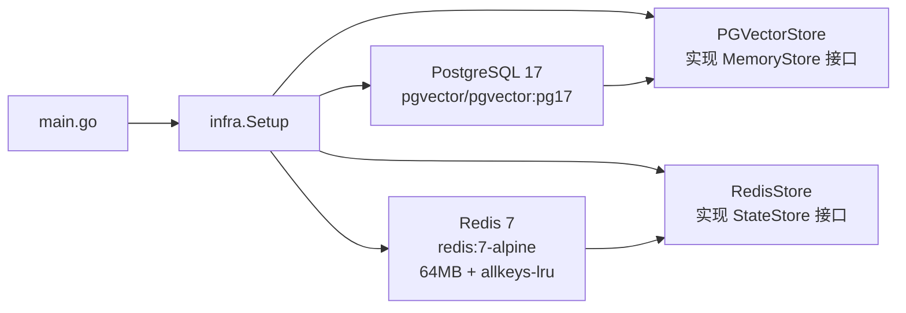
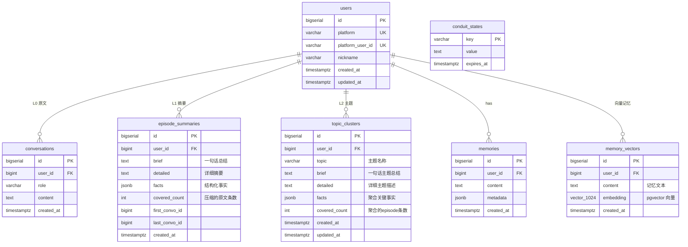

# 蓝妹架构图

## 系统总览

## 消息处理流程

## 行为树结构

优先级从上到下：管理员命令 > 普通命令 > 意图分析（自然语言路由）

## 基础设施层

## 存储层设计

## 待实现 / 规划中

- [ ] LLMClient 具体实现（等用户指定 provider）
- [ ] Embedder 具体实现（等用户指定 provider）
- [x] Function Calling 自然语言命令路由（IntentPass）— 骨架已搭好，LLM 接入后自动生效
- [ ] 多路召回（向量 + 关键词 + 时间）
- [x] LOD 记忆压缩（L0 原文 → L1 摘要 → L2 主题）
- [ ] 签到记录表
- [ ] 状态面板前端
