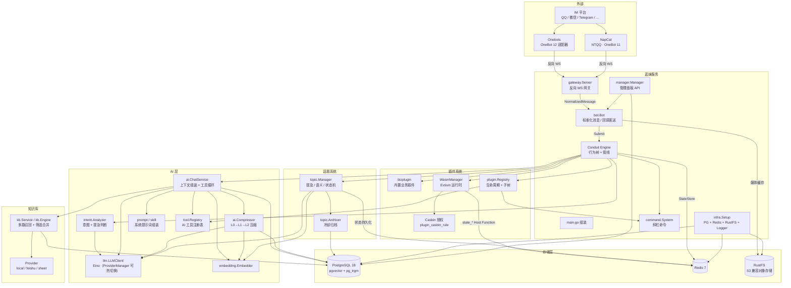
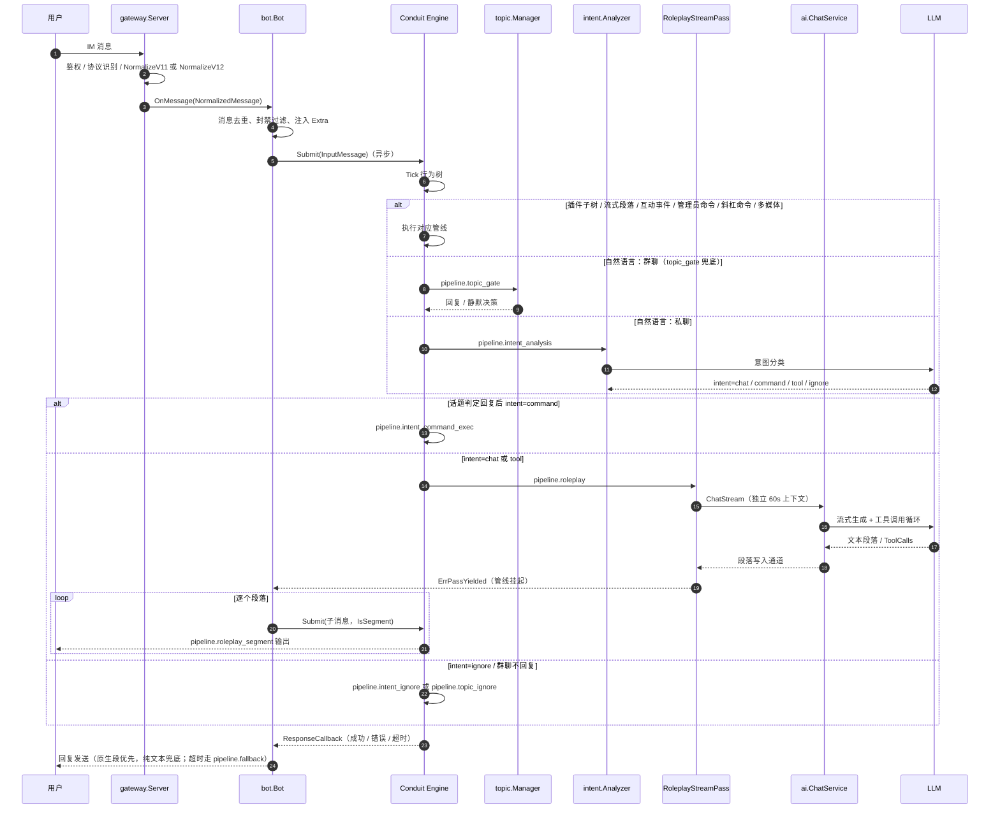
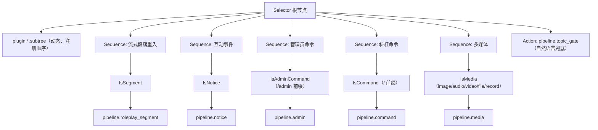
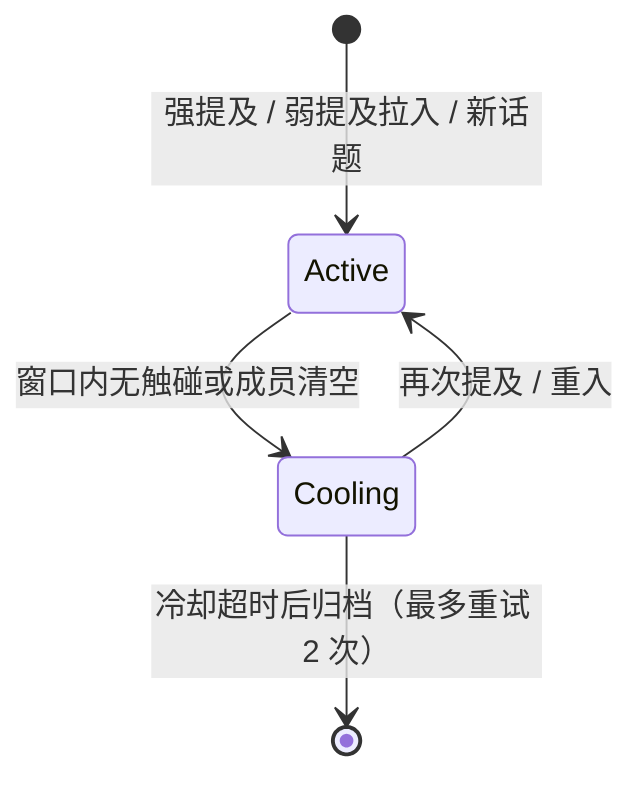
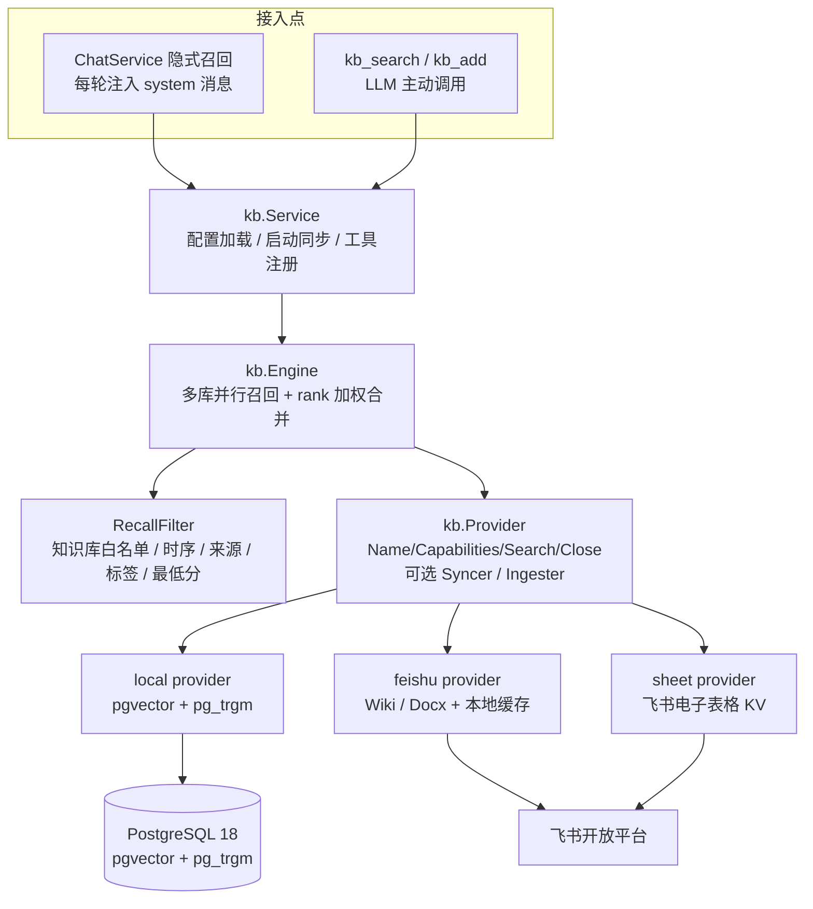
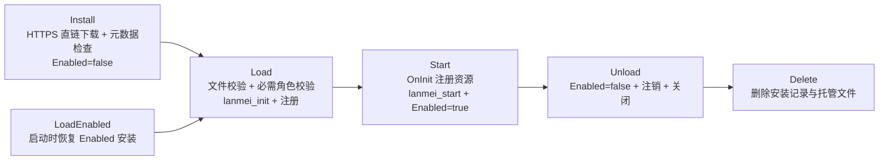
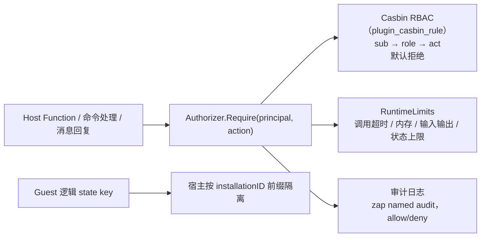

# 蓝妹架构

本文描述代码当前实际实现的结构。数据流细节见 [data-flow.md](data-flow.md)；插件权限与 ABI 细则见 [../internal/plugin/access_control.md](../internal/plugin/access_control.md) 与 [../internal/plugin/wasm_abi.md](../internal/plugin/wasm_abi.md)。

## 系统总览

蓝妹是单进程 Go 服务：`cmd/lanmei/main.go` 组装基础设施、网关、Bot（Conduit 引擎）、AI 层、插件系统与可选的管理面板。管理面板独立端口（Fiber），与主服务共享 PostgreSQL / Redis。

## 消息处理流程

Bot 用异步 `Submit` + `ResponseCallback` 与引擎交互（不阻塞网关读循环）；流式回复通过“挂起管线 + 段落子消息重入”投递。核心管线全部以动态管线（PassID 引用）注册，管理面板可可视化调整 Pass 顺序。

补充行为：

- **入口过滤**：同一连接内重复 `message_id` 丢弃（Redis SETNX，TTL 5 分钟）；被封禁用户消息静默丢弃；机器人自身消息回显不参与会话追踪。
- **出站**：优先发送插件写入的 OneBot 12 语义原生段（`at/text/image`），否则遍历管线输出逐条发文本；群聊中命令、工具、at、话题提及等“明确指向性”回复会自动 at 请求者；流式回复首段承担引用/at。
- **互动事件**：`notice`/`request` 事件经 `pipeline.notice` 记录日志（插件子树可先行消费），出错时只记日志、绝不回复。
- **错误与超时**：管线返回错误由回调回复兜底话术；管线执行超时（引擎 20s）才触发 `pipeline.fallback`（`FallbackPass` 固定话术）。

## 行为树与管线

### 行为树结构

主行为树为 Selector，优先级从上到下；插件子树在注册/卸载后触发重建，始终排在最前。

管理员命令判断先于普通命令（两者都以 `/` 开头）；自然语言兜底先进入话题门控（群聊）或直接进入意图分析（私聊）。

### 核心管线与 Pass

| 管线 ID | Pass 链（注册 ID） | 触发 / 来源 |
|---|---|---|
| `pipeline.topic_gate` | `pass.topic.gate`（TopicGatePass，RouterPass） | 非命令、非媒体消息兜底；群聊提及/话题决策 |
| `pipeline.intent_analysis` | `pass.intent.analysis`（IntentAnalysisPass，RouterPass） | 私聊消息；或私聊媒体消息放行 |
| `pipeline.roleplay` | `pass.roleplay.stream`（RoleplayStreamPass） | intent=chat/tool，或话题命中回复；流式并挂起管线 |
| `pipeline.roleplay_segment` | `pass.roleplay.segment`（RoleplaySegmentPass） | 流式段落子消息（`IsSegment` 条件） |
| `pipeline.intent_command_exec` | `pass.intent.command_exec`（IntentCommandExecPass） | intent=command；内部复用 `ExecuteCommandPass` |
| `pipeline.intent_ignore` | `pass.intent.ignore`（IntentIgnorePass） | 私聊 intent=ignore：保存消息不回复 |
| `pipeline.topic_ignore` | `pass.topic.ignore`（TopicIgnorePass） | 群聊不回复：保存消息不回复 |
| `pipeline.command` | `pass.command.router` → `pass.command.execute` | `/` 开头的斜杠命令 |
| `pipeline.admin` | `pass.admin.guard`（超管校验）→ `pass.admin.command`（CommandPass） | `/admin` 开头 |
| `pipeline.media` | `pass.media.process` → `pass.media.router` | 含多媒体段的消息 |
| `pipeline.notice` | `pass.notice.gate`（NoticeGatePass） | notice/request 互动事件 |
| `pipeline.fallback` | `pass.fallback`（FallbackPass） | 仅管线超时（引擎 `WithFallbackPipeline`） |

插件注册的管线遵循 `plugin.<id>.pipeline.<name>`、Pass `plugin.<id>.pass.<name>`、子树 `plugin.<id>.subtree` 命名；内置插件在 `OnInit` 中自行注册（如 `sticker` 注册 collect/delete/send/list 四条管线，`music` 注册 search/select 两条）。

### 动态路由规则

| 路由 Pass | 条件 | 目标管线 |
|---|---|---|
| MediaRouterPass | 群聊 | `pipeline.topic_gate` |
| MediaRouterPass | 私聊且有文本或图片已理解 | `pipeline.intent_analysis` |
| MediaRouterPass | 私聊且无可用描述 | `pipeline.intent_ignore` |
| TopicGatePass | 话题系统未启用或私聊 | `pipeline.intent_analysis` |
| TopicGatePass | 群聊决策不回复 | `pipeline.topic_ignore` |
| TopicGatePass | 群聊回复且 intent=command | `pipeline.intent_command_exec` |
| TopicGatePass | 群聊回复且 intent=chat/tool | `pipeline.roleplay` |
| TopicGatePass | 群聊回复且 intent=ignore / 结果缺失 | `pipeline.topic_ignore` |
| IntentAnalysisPass | intent=chat/tool（ChatSvc 不可用时 fallback） | `pipeline.roleplay` |
| IntentAnalysisPass | intent=command | `pipeline.intent_command_exec` |
| IntentAnalysisPass | intent=ignore | `pipeline.intent_ignore` |
| IntentAnalysisPass | 结果缺失 / 其他 | `pipeline.fallback` |

### Conduit 引擎配置

| 配置 | 值 | 位置 |
|---|---|---|
| Workers | 4 | `bot.New` |
| 管线超时 | 20s | `bot.New`（LLM 慢响应前完成，避免群聊静默） |
| 降级管线 | `pipeline.fallback` | `bot.New` |
| 执行链路追踪 | 开启（`WithTracing`） | 供管理面板 Trace 采集 |

## 意图分析

`internal/ai/intent` 用一次 LLM 调用（`intent_timeout_seconds`，默认 8s，独立于消息 20s 预算）完成意图分类；群聊时同一调用附带“是否在跟机器人说话”的提及判断（注入机器人名字与最近 6 条对话供指代消解）。

- **意图取值**（封闭四类）：`chat`（闲聊/角色扮演）、`command`（命中斜杠命令，带 `command` 与 `args`）、`tool`（命中工具，带 `tool`）、`ignore`（无需回复）。`chat` 与 `tool` 当前路由一致，均进入对话管线由流式工具循环执行。
- **降级行为**：LLM 未配置 → `chat`/置信度 1.0；调用失败 → `chat`/0.5（群聊提及判断同时按“未提及”处理）；JSON 解析失败/非法意图值 → `chat`（宽容解析失败为 0.5）；置信度 clamp 到 `[0,1]`。意图分析故障不中断消息处理。
- **提示词**：动态注入可用命令列表（`command.System.List`）与工具列表（`tool.Registry.ToolInfos`）；插件注册后由 `Bot.RefreshIntentAnalyzer` 刷新。分析请求禁用思考（推理开销会拖慢调用导致提及误判）。
- **执行**：`IntentAnalysisPass`（私聊）与 `TopicGatePass`（群聊）都只写入 `*intent.Result`（`ctx.data`），由 Route 决定下游管线；`command` 意图的参数透传 LLM 提取结果，命令不存在时回复“不认识命令”而非静默降级。

## 角色扮演与流式回复

`RoleplayStreamPass`（`pipeline.roleplay`）是对话入口：

1. 取/建用户，读取话题上下文（群聊命中话题时由 TopicGatePass 写入黑板），创建 32 缓冲的段落通道；
2. 用独立 `context`（60s 超时，覆盖多轮工具调用）启动 `ChatService.ChatStream`，并把通道写入 `ctx.data`；随后返回 `ErrPassYielded` 挂起管线——引擎回调 `Bot.streamSegments`；
3. `Bot.streamSegments` 逐段派生子消息（`NewChildInput` + `IsSegment`）重入引擎，走 `pipeline.roleplay_segment` 输出，按“上一段实际发送时间 + 字数 × 打字速度 ± 抖动”的节奏发送（`bot.stream.*` 配置；`typing_speed_ms=0` 关闭节奏控制）；
4. 流结束后保存 L0 对话（user 消息 + 非空 assistant 消息；调用过工具时 assistant 消息标记为插件来源并记录首个工具名），话题命中时调用 `TopicManager.RecordBotReply` 追加 Bot 发言并授回复配额，并按 `pick_sticker` 结果维护表情情绪窗口。

健壮性：LLM 空响应重试一次（关闭思考），仍为空发送提示段；流失败发送错误提示段；段落投递前一段完成才提交下一段，保证顺序。

`ChatService.Chat`（非流式）保留给工具/内部调用路径，与 `ChatStream` 共用上下文组装与工具循环语义（循环上限 5 轮）。

## AI 上下文组装

`assembleContext` 是对话的上下文装配点，按以下顺序写入消息列表：

1. **System Prompt**：`prompt.Manager` 模板组装（未配置时用 `DefaultSystemPrompt`），其中 `Conversation` 文本由 LOD 的 L2 主题 + L1 摘要拼成；
2. **表情表达规则**：注入表情情绪滑动窗口快照，控制发图节奏；
3. **防注入安全规则**：优先级最高的 system 消息，声明用户消息/知识库/记忆/工具输出均视为数据；
4. **LOD 历史**：token 预算 3000，按 L2 → L1 → L0 优先级填充（详见“记忆与压缩”）。普通场景 L0 原文作为独立 user/assistant 消息追加（插件来源回复替换为“用户使用了 XX 功能”占位，避免随机结果污染）；话题场景改用话题近期消息（带“昵称(用户ID)：”发言者标注）替代 L0；
5. **长期记忆 RAG**：多路召回（向量权重 1.0 / 关键词 0.8 / 时间 0.5，rank 加权合并）取 top5，注入为外部数据 system 消息；
6. **长期事实画像**：私聊注入用户画像、群聊注入本群画像，最多 10 条；低于置信度门槛过滤，低置信/证据较早/曾有矛盾分别标注；
7. **知识库隐式召回**：默认最多 3 条，作为 system 消息注入（复用 RAG 阶段已算好的查询向量）；
8. **当前用户消息**：话题场景补发言者前缀后追加。

## AI 工具调用

- `tool.Registry` 基于 Eino `schema.ToolInfo` 管理工具，内置插件通过 `PluginInfo.Tools` 注册，WASM 插件通过 `lanmei_handle`（`event_type=tool_call`）响应。
- `ChatService.processToolCalls` 最多循环 5 轮：LLM 返回 ToolCalls → 逐个执行 → 结果以 Tool 消息回传 → 再次生成；无 ToolCalls 即结束。工具调用失败不中断循环，错误文本回传给 LLM 自行决策；循环超出上限后取最后一条 assistant 文本作为回复，若全空则取最后一条消息兜底。
- 绑定工具失败时降级：流式路径退回基础模型（本轮不注入工具），非流式路径回退普通 `Chat` 调用。

## 记忆与压缩

### LOD 三级

| 层级 | 存储 | 内容 | 生成方式 |
|---|---|---|---|
| L0 原文 | `conversations` | user/assistant 原文，含来源（chat/plugin）与插件标签 | 对话/忽略管线直接写入 |
| L1 摘要 | `episode_summaries` | brief + detailed + 带置信度 facts + 覆盖范围 | 压缩器批量 LLM 压缩（**仅私聊维度**） |
| L2 主题 | `topic_clusters` + `memory_vectors` | topic + brief + detailed + 合并 facts | L1 批量 LLM 聚合，向量写入 pgvector |

LOD 组装（`GetLODContext(budget=3000)`）：先填 L2 brief（最近 10 条）→ 再填 L1 brief/detailed（最近 10 条）→ 剩余预算给 L0 原文（每条粗估 30 token，条数 clamp 到 2~40）；按 `group_id` 隔离群聊与私聊历史。

### 压缩阈值

- L0→L1：私聊原文超过 **40** 条触发，每次压缩最老的 **20** 条（压缩后至少余 20 条，天然缓冲）；
- L1→L2：私聊摘要超过 **10** 条触发，每次聚合最老的 **5** 条；
- 单次压缩 LLM 调用 60s 超时；按用户加锁串行化，避免并发重复压缩；先写摘要再删原文，防止数据丢失；
- 事实三态合并（重复确认提升置信度，封顶 0.98），L0→L1 标注证据来源 `conv:<id>-<id>`。

**群聊不参与上述压缩**：群聊 L0 只增不减，由话题系统在冷却归档时沉淀群级记忆（`memory_vectors` + `memories`，`user_id=0`）与群画像事实（`group_facts`）。

### 记忆维护

`ai.MemoryMaintainer` 每 6 小时后台清理：每个 `(user_id, group_id)` 仅保留最近 200 条 L0 原文、每个用户保留最近 50 个 L2 主题、删除 180 天未更新的向量记忆；LOD 组装的 L2/L1 摘要与近期原文不受影响。

## 群聊话题系统

`internal/topic` 决定“群聊是否应回复”，避免全量回复与刷屏。

- **提及判定**（`classifyMention`）：at 命中机器人自身 ID 恒为强提及；其余由意图分析 LLM 返回的提及判断分档——强证据角色（呼格/主语/祈使宾语/情感对象）且提供可核实证据时，置信度达弱阈值（默认 0.4）即按强提及处理；否则置信度 ≥ 强阈值（默认 0.7）为强提及、≥ 弱阈值（默认 0.4）为弱提及（静默拉入并授回复配额，不立即回复）。
- **语义判定**：每条消息最多 embedding 一次，话题语义中心用 EMA（α=0.3）更新；`semantic_threshold` 关闭或向量不可用时降级为成员制；话题匹配取相似度最高且达阈值者，否则取最近活跃话题。
- **状态机**：活跃窗口默认最近 20 条群消息（`topic_window_msgs`）；窗口内无触碰转冷却；冷却超时（默认 30 分钟）后异步归档，归档扫描间隔默认 60 秒；超过 2 次归档失败丢弃话题。话题状态与索引持久化在 Redis（conduit StateStore），启动时恢复。
- **回复配额**（`credit_enabled`）：Bot 真实回复成功后给被回复用户授 1 次配额，下一条相关消息可直接回复；配额在真实回复时消耗，避免“决策回复但未发出”时误扣。
- **归档**：LLM 生成 brief/detailed/facts（无 LLM 时降级为标签 + 原文拼接）；写群级 `memories` + 向量记忆（`memory_vectors`），facts 并入 `group_facts` 群画像。
- **未命中**：群消息仍保存到 `conversations`（带 `group_id`），供后续群回忆查询，但不进入话题归档链路。

## 知识库系统

- **召回模式**：`vector`（向量余弦）、`fuzzy`（模糊/全文）、`time`（按更新时间）；默认合并权重 1.0 / 0.8 / 0.5（可配置），同分块多路命中分数累加，去重键为 `provider + 知识库 ID + 分块 ID`。
- **引擎行为**：按知识库并行调用 Provider（单个软超时 15s，失败仅告警丢弃该库结果）；请求模式按 Provider 能力过滤；筛选条件（白名单/时序/来源/标签/最低分）在合并后统一应用；最终条数默认 5，单库召回上限取配置 `bases[].recall_limit`（默认 5）。
- **Provider 实现**：
  - `local`：PostgreSQL 存储，支持 vector/fuzzy/time 与内容摄入——`docs_dir` 下 Markdown/CSV 文件同步 + `kb_add` 工具写入；HNSW 向量索引 + `pg_trgm` GIN 索引；
  - `feishu`：Wiki/Docx API，文档与向量 TTL 缓存、本地评分召回（无 embedder 时仅 fuzzy/time）；
  - `sheet`：飞书电子表格两列 KV，整表拉取到本地缓存（TTL）后计算召回，支持 fuzzy 与可选 vector。
- **服务层**：构造时对实现 `Syncer` 的 Provider 做启动同步（30s 软超时，失败不阻塞启动）；隐式召回默认条数 3（`auto_recall_limit`）；`kb_search`/`kb_add` 注册进工具注册表参与对话工具循环。

## 插件系统

内置插件与 WASM 插件共用同一个 `plugin.Registry`：同名插件已由 WASM 加载时跳过内置注册（WASM 优先）；两者都通过 `PluginInfo` 声明命令、工具与行为树子树。

### 内置插件（bizplugin）

由配置 `[plugin.builtins]` 开关控制，当前实现：

| 插件 ID | 名称 | 插件 ID | 名称 |
|---|---|---|---|
| `signin` | 签到（签到/试试手气） | `sticker` | 表情库（收藏/删除/发送/列表） |
| `signin_rank` | 签到排行 | `turtle_soup` | 海龟汤 |
| `welcome` | 入群欢迎 | `answer_question` | 编程答题 |
| `poke` | 戳一戳回复 | `daily_quote` | 每日一句 |
| `three_g` | 3G 科普 | `random_beauty` | 随机美图（预审核图池） |
| `zhaoxin_group` | 招新群导航 | `cat` | 猫猫图片 |
| `music` | 网易云点歌 | `balogo` | BA-LOGO 生成 |
| `github_card` | GitHub 卡片 | `ping` | Ping |

内置插件的私有数据优先使用受限 KV（`PluginContext.KV`，PostgreSQL `plugin_kv` 表，按插件 ID 隔离命名空间），如签到积分与排行榜；Redis StateStore 用于短期状态。

### WASM 插件生命周期

- ABI 固定 `lanmei.plugin/v1`，Guest 必须导出 `lanmei_plugin_info` / `lanmei_init` / `lanmei_handle`（可选 `lanmei_start` / `lanmei_stop`）；载荷为 UTF-8 JSON，Extism bytes-in/bytes-out。
- `OnInit` 注册命令、工具、Pass/Pipeline/子树并登记到 Registry；卸载时 Registry 自动清理这些资源并重建行为树。
- 插件命令经 `makeCommandHandler` 重入引擎（带 `bot.command.reentry` 防死循环标记），由插件子树消费；WASM 命令由共享的 `WasmCommandPass` 调用 Guest。

## 插件安全模型

当前生效的权限/资源控制链（与 [../internal/plugin/access_control.md](../internal/plugin/access_control.md) 一致）：

- **主体**：`plugin::<pluginID>::<installationID>`（宿主可信构造，绝不信任 Guest 传入的插件/安装 ID）、`user::<id>`、`system::<name>`。
- **动作**：`command.handle`、`message.reply`、`state.read/write/delete`，以及 `plugin.*` 管理动作、`role.read/manage`、`audit.read`；`Require` 精确匹配，无策略即拒绝。
- **角色**：`role::plugin_command_basic`（命令插件基础动作）、`role::plugin_runtime`（`plugin.load/start`，供 `system::startup` 恢复已启用插件）、`role::bot_owner`（全部管理动作，由超级用户引导绑定）。
- **插件声明**：WASM 在 `lanmei_plugin_info.requested_roles` 声明所需角色；`Load` 校验必需角色是否已授予，未授予则拒绝加载。声明不是授权。
- **运行时约束**：Extism 限制单次调用 3s、内存 256 页（16 MiB）、Guest 输入 256 KiB / 输出 64 KiB、单次输出 8 条 / 每条 4096 字节、state key 256 字节 / value 64 KiB / TTL 最长 30 天；Wasm 文件上限 16 MiB。
- **审计**：`AuditLogger`（zap `audit` 命名空间）记录 principal/permission/scope/decision/reason；权限拒绝同时以 Warn 记录。
- **尚未接入运行时**：`capability.go` 的 `Capability`/`Scope`/`PermissionSet`/`ResourceQuota` 模型与 `ScopeChecker`、`DBAccess`、`HTTPAccess` 已在代码中定义（WIT 也声明了 `db_query/db_exec/http_get/http_post` Host 接口），但当前生产实例只注入 6 个 `state_*` Host Function，上述设施未接入授权流程（见“已实现 / 规划中”）。

## 存储层

表由 `database.Migrate`（GORM AutoMigrate，幂等）创建，另加 Casbin 策略表。

| 表 | 用途 |
|---|---|
| `users` | 平台用户（platform + platform_user_id 唯一） |
| `conversations` | L0 原文，含 `group_id` 与来源（chat/plugin） |
| `episode_summaries` | L1 摘要 + 结构化事实 |
| `topic_clusters` | L2 主题聚合 |
| `memories` | 群级记忆元数据（话题归档写入；检索由 `memory_vectors` 承担） |
| `memory_vectors` | 长期记忆向量（pgvector，HNSW + tsvector 全文索引） |
| `group_facts` | 群聊长期事实画像（按 group_id + key 唯一） |
| `knowledge_chunks` | 知识库分块（pgvector HNSW + pg_trgm GIN） |
| `media_files` | 媒体文件缓存记录（sha256 内容寻址，对应 RustFS 对象） |
| `plugin_installations` | WASM 插件安装记录（SHA-256、配置、启用状态、加载错误） |
| `plugin_kv` | 插件受限 KV（按插件 ID 隔离） |
| `plugin_casbin_rule` | Casbin 策略（角色绑定与动作授权） |
| `sticker_library` | 表情库 |
| `random_beauty_pool` | 随机美图预审核图池 |
| `bot_admin` | 动态管理员（超管集合持久化） |
| `manager_admin` / `auth_credential` / `auth_session` / `login_attempt` | 管理面板管理员、凭据（密码/TOTP/WebAuthn）、会话、登录尝试 |
| `audit_log` | 管理面板操作审计 |
| `config_revision` | Conduit 行为树/管线编辑版本（可回滚） |
| `conduit_trace` / `node_traffic` | 执行链路 Trace 与节点流量聚合 |
| `llm_provider` / `token_usage` | LLM Provider 配置与用量计费 |
| `group_config` / `scheduled_job` | 群级配置与定时任务 |

索引与扩展：

- 启用 `vector` 与 `pg_trgm` 扩展；`memory_vectors.embedding`、`knowledge_chunks.embedding` 建 HNSW 余弦索引；
- `memory_vectors.search_vec` 由触发器从 `content` 自动维护 `tsvector`（simple 配置，适合中文按空白切分），用于关键词召回；
- `knowledge_chunks.content` 建 pg_trgm GIN 索引用于模糊召回；向量维度默认 1024，`ai.embedding_dim` 不同时迁移阶段 ALTER 知识库向量列。

Redis 用途：

- Conduit `StateStore`（`conduit:` 前缀）：TTL、CAS（Lua 原子脚本）、INCRBY、SETNX；
- 话题系统状态持久化与 `topic:index` 索引（支持重启恢复）；
- 消息去重键（`dedup:msg:<conn>:<message_id>`，5 分钟 TTL）；
- 用户映射缓存（`GetOrCreateUser` 免查库）。

RustFS（S3 兼容对象存储）：媒体图片缓存，key 为内容寻址（sha256 前 8 字节的 16 位十六进制 + 扩展名），内网预签名 URL 在发送前转 base64。

## 基础设施与管理面板

**基础设施**（`infra.Setup`）：连接 PostgreSQL → 迁移（建表 + 扩展 + 索引 + 触发器）→ 构建 `PGVectorStore`（MemoryStore）→ 连接 Redis → 构建 `RedisStore`（StateStore）与用户缓存 → 初始化 RustFS 对象存储（未配置时媒体缓存降级）→ zap Logger（lumberjack 轮转）。任一步失败即中止启动。

**管理面板**（`internal/manager`，`manager.enabled` 开启）：Fiber 独立端口，托管管理前端静态资源并挂载 `/api`，与主服务共享 PG/Redis：

- **认证**：JWT Access/Refresh Token；密码登录 + TOTP（加密落库）+ WebAuthn/passkey；登录限流、失败锁定、会话上限；敏感操作需 step-up 二次验证；CSRF 中间件；超级管理员由环境变量引导（`LANMEI_MANAGER_*`）。
- **Conduit 控制平面**：读取行为树/管线/子树快照，应用编辑（行为树、管线、子树）并保存 `config_revision`，支持按版本回滚。
- **Trace**：采集执行链路（`conduit_trace`）与节点流量（`node_traffic`），提供查询与 SSE 实时流。
- **审计与计费**：管理操作写 `audit_log`；`token_usage` 记录各 Provider/场景的 token 用量与费用。
- **内容管理**：群组配置、用户封禁、知识库（列表/分块/同步）、记忆、插件启停、Skills、Prompt 片段、表情包、命令列表。
- **LLM 管理**：`llm_provider` 的增删改查、启用切换与用量统计；运行时通过 `ProviderManager` 热切换。

## 已实现 / 规划中

已实现：

- [x] 网关协议适配（OneBot 11/12 反向 WS、三端点、鉴权、协议/平台识别、notice 事件白名单）
- [x] 消息去重、封禁过滤、异步 Submit + 回调发送、明确指向性回复自动 at、引用/会话新旧判定
- [x] 行为树 + 动态管线（插件子树优先；核心 12 条管线；管理面板可编辑 Pass 顺序）
- [x] LLMClient（Eino + eino-ext OpenAI 兼容，支持 ToolCalling）与 ProviderManager 热切换
- [x] Embedder（Eino/OpenAI 兼容 + 火山方舟多模态 Embedding 专用实现）
- [x] 意图分析（4 类意图 + 群聊提及判断，超时降级）
- [x] 流式角色扮演（分段投递、打字节奏、引用/at、空响应重试）
- [x] AI 工具注册表与工具调用循环（内置插件工具 + WASM 工具）
- [x] 群聊话题系统（at/语言学提及、语义匹配、回复配额、冷却归档、Redis 持久化恢复）
- [x] LOD 记忆压缩（L0→L1→L2，仅私聊维度）与记忆维护（保留上限 + 时间衰减）
- [x] 多路召回（向量 + 关键词 + 时间加权合并）
- [x] 知识库系统（Provider 抽象 + 多路召回引擎 + 筛选；local/feishu/sheet 三种 Provider）
- [x] 隐式知识召回 + `kb_search`/`kb_add` 工具
- [x] 插件系统（内置 bizplugin + WASM Extism 运行时；注册/初始化/启停/卸载与资源自动清理）
- [x] WASM 安全模型（Casbin 角色-动作授权、安装实例主体、state_* Host Function 鉴权、运行时限额、审计）
- [x] 多模态媒体管线（图片下载 → RustFS 内容寻址缓存 → 视觉理解描述；非图片段仅记录）
- [x] 表情库与表情情绪窗口（按群/私聊控制发图节奏）
- [x] 统一日志（zap + lumberjack 轮转）
- [x] 管理面板（认证/TOTP/WebAuthn、Conduit 控制平面与回滚、Trace + SSE、审计、计费、内容管理）

规划中 / 未接入：

- [ ] WASM 的 `db_query/db_exec`、`http_get/http_post` Host Function 接入运行时（WIT 与 `DBAccess`/`HTTPAccess` 已定义，生产实例当前只注入 `state_*`）
- [ ] `Capability`/`Scope`/`ResourceQuota` 授权模型接入（代码已定义；当前以 Casbin 角色+动作与 `RuntimeLimits` 生效）
- [ ] 非图片媒体（音频/视频/文件）内容解析（当前仅缓存/记录）
- [ ] 新知识库 Provider（如腾讯 IMA）与新的召回模式（如图召回）
